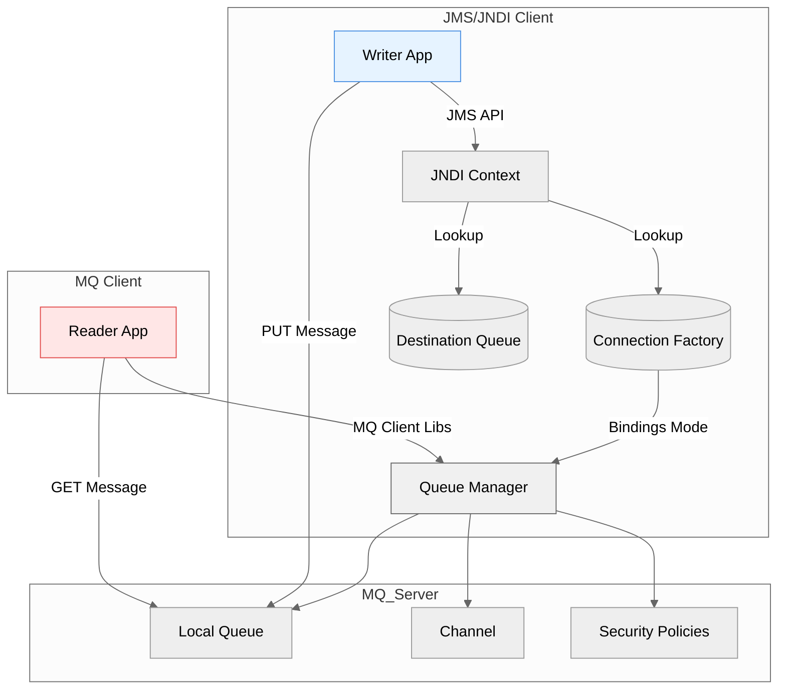

# jms

```mermaid
%%{init: {'theme':'neutral'}}%%
flowchart TD
    subgraph Writer_Application[JMS/JNDI Client]
        A[Writer App] -->|JMS API| B[JNDI Context]
        B -->|Lookup| C[(Connection Factory)]
        B -->|Lookup| D[(Destination Queue)]
        C -->|Bindings Mode| E[Queue Manager]
    end

    subgraph MQ_Server
        E --> F[Local Queue]
        E --> G[Channel]
        E --> H[Security Policies]
    end

    subgraph Reader_Application[MQ Client]
        I[Reader App] -->|MQ Client Libs| E
    end

    A -->|PUT Message| F
    I -->|GET Message| F

    style A fill:#e6f3ff,stroke:#4a90e2
    style I fill:#ffe6e6,stroke:#e24a4a
    style E fill:#f0f0f0,stroke:#666
```